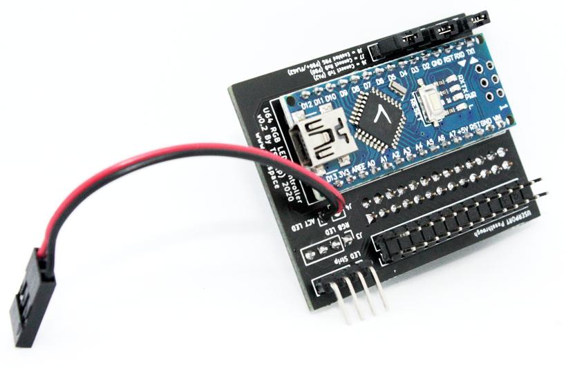
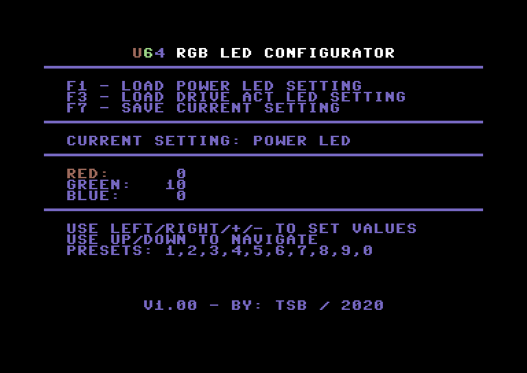

Introduction
============

Ultimate 64 RGB LED Controller is an addon module for the Ultimate 64 (U64), which allows you to select your own custom LED colours for the power & activity LED. 

The colours can be change by using a simple basic tool which communicates over the serial port with the module. 

See change log for history.

Documentation
=============
Full documentation can be found on my blog: https://www.tsb.space/projects/u64-rgb-led-controller/

# Disclaimer

The project described on this page is a hobby project, I took all the effort to describe all the information on this page as completely and as carefully as possible.

I can not be held responsible for any damage to your equipment, building this project is entirely at your own risk. If you do not have the knowledge to build this project, ask someone who does have this knowledge to prevent damage to your devices.

Use at your own risk.